## SNIES Extractor
Gracias al grupo que me presetó el código fuente de este proyecto

## Presentación general
En este proyecto se utilizarán varias clases para cumplir el propósito de extraer la información del Sistema Nacional de Información de Educación Superior. Para el usuario, este tendrá una interfaz por terminal que le indicará los pasos a seguir y la información que necesita digitar.

## Cumplimiento de Requerimientos

1. **Solicitar rango de años a analizar**  
   En el menú, se le pregunta al usuario cuál es el primer año de búsqueda, tomando en cuenta que los rangos de años siempre son consecutivos, el segundo año de búsqueda se calcula a partir del primero.

2. **Lectura de archivos .csv correspondientes**  
   A partir de los años ingresados por el usuario, el controlador (clase `SNIESController`) leerá la información de los archivos apropiados uno por uno.

3. **Calcular admitidos, inscritos, graduados, matriculados y matriculados de primer semestre por programa y por año**  
   El SNIES-Extractor, mediante su controlador, calculará estos datos por cada programa y año a partir de los datos en bruto que extrae de los archivos .csv apropiados.

4. **Generación de Archivos de Salida**  
   Al terminar de extraer la información y procesarla, el SNIES-Extractor generará un archivo de resultados en la siguiente carpeta que ya debería estar parametrizada en el disco duro:  
   `C:\SNIES_EXTRACTOR\outputs\resultados.csv`.

5. **Visualización de Datos**  
   El SNIES-Extractor muestra al usuario el consolidado de estudiantes por año en programas presenciales o virtuales, la diferencia porcentual anual entre la cantidad de nuevos matriculados durante los años de búsqueda por programa y la lista de programas sin nuevos matriculados en 3 semestres consecutivos. Además, permitirá al usuario exportar esta información en un archivo ubicado en la carpeta ya parametrizada:  
   `C:\SNIES_EXTRACTOR\outputs\extras.csv`.

6. **Filtrado de Programas**  
   Se le pregunta al usuario si desea hacer una búsqueda con 2 filtros entre los programas solicitados: una palabra clave para buscar según los nombres de programas y el nivel de formación de los programas.

7. **Validación de Datos**  
   El SNIES-Extractor es un programa de C++ robusto que puede detectar errores a la hora de recibir información fuera de rangos esperados, tanto de parte del usuario como de la lectura de los archivos .csv.

Más abajo podrán encontrar el diagrama UML de las clases.

# Correción de errores
   ###  1) Refactorizacion inicial del diagrama de clases : 
Se añadieron nueva clases en el diagrama UML (GestorJson, GestorDatos) donde GestorDatos es la clase padre que hereda sus metodos a las otras clases.

   ### 2) Creación clase GestorJson :
Se implemento una nueva clase que permite exportar documentos de tipo .Json.
   ### 3) Creación clase GestorTxt :
Se implemento una nueva clase que permite exportar documentos de tipo .Txt.

   ### 4) Refactorización clases Consolidado y ProgramaAcademico :
   Se refactorizo las clases Consolidado y ProgramaAcademico para adecuarlas a los principios GRASP.
   ### 5) Creacion clase Settings :
   se implemento una nueva clase en el proyecto donde el usuario es libre de la configuracion.
   ### 6) Modificación de los prototipos de las clases :
   Se modificaron diferentes atributos y metodos de las clases Consolidado, ProgramaAcademico, GestorCSV y SNIESController con el objetivo de reducir la complejidad, aumentar la cohesión y disminuir la codependencia.
   ### 7) Creacion de clase GestorDatos :
   Se implemento una nueva clase quien es la clase padre de GestorCsv, GestorJson, GestorTXT.
   ### 8) Refactorización del metodo exportarDatos :
   se realizaron correciones en el header ya que sonarline siguirio cambiar nuetros std:: en la cabezera y tambien se añadio la libreria estandar.
   ### 9) Implementacion clases ProgramaAcademico y Consolidado
   Se implemento los prototipos de esas clases teniendo como objetivo la construccion de una serie de métodos auxiliares que permitan facilitar las tareas y métodos de las demás clases.
   ### 10) Solucion de error en la clase GestorCSV :
   Se soluciono el error usando using namespace std::.

# Diagrama Mermaid

*El vector de Consolidados tendrá siempre 8 posiciones [0-7] donde:*
*vector[0] es primer año, primer semestre, hombres*
*vector[1] es primer año, segundo semestre, hombres*
*vector[2] es primer año, primer semestre, mujeres*
*vector[3] es primer año, segundo semestre, mujeres*
*vector[4] es segundo año, primer semestre, hombres*
*vector[5] es segundo año, segundo semestre, hombres*
*vector[6] es segundo año, primer semestre, mujeres*
*vector[7] es segundo año, segundo semestre, mujeres*

```mermaid
classDiagram
direction BT
    class ProgramaAcademico {
       -map<string, string> datos
       -map<string, Consolidado *> consolidados
       -int getMatriculadosNuevosPorSemestre(int) const
       -int getMatriculadosNuevosPorAnio(int) const
       -int getMatriculadosPorSemestre(int) const
       +int getMatriculadosPorAnio(int) const
       +ProgramaAcademico() = default
       +~ProgramaAcademico()
       +void setDato(string const &, string)
       +string getDato(string const &)
       +bool sinMatriculasNuevas() const
       +bool contienePalabraClave(string const &) const
       +bool tieneNivelDeFormacion(string const &) const
       +void addConsolidado(string const &, Consolidado *)
       +void modificarConsolidado(string const &, string const &, string const &)
       +void mostrarMatriculadosConsolidado()
       +void mostrarDiferenciaPorcentualNuevosMatriculados() const
       +void mostrarIdentificadoresPrograma()
       +void mostrarInformacionPrincipalPrograma()
       +string toTxt() const
       +string toJson() const
       +string toCsv() const
       -void calcularDiferenciaPorcentualNuevosMatriculados() const;
    }
    class Consolidado {
        -int inscritos
        -int admitidos
        -int matriculadosPrimerSemestre
        -int matriculados
        -int graduados
        -int idSexo
        -string sexo
        -int ano
        -int semestre
        +setIdSexo(int)
        +setSexo(string)
        +setAno(int)
        +setSemestre(int)
        +getIdSexo()
        +getSexo()
        +getAno()
        +getSemestre()
        +setInscritos(int)
        +setAdmitidos(int)
        +setMatriculadosPrimerSemestre(int)
        +setMatriculados(int)
        +setGraduados(int)
        +getInscritos()
        +getAdmitidos()
        +getMatriculadosPrimerSemestre()
        +getMatriculados()
        +getGraduados()
        -map<string, string>datosConsolidado
        +string toTxt() const
        +string toJson() const
        +string toCsv() const
    }
    
    
    class GestorDatos{
    # GestorDatos();
    # ~GestorDatos();
    # virtual void exportarDatos(const string & filePath)
    }
    
    class GestorCsv {
        -string convertirStringFormaEstandar((string &stringIn)
        +GestorCsv() = default
        +vector<int> leerProgramasCsv(string &ruta)
        +vector<vector<string>> leerArchivoPrimera(string &rutaBase, string &ano, vector<int> &codigosSnies)
        +vector<vector<string>> leerArchivoSegunda(string &rutaBase, string &ano, vector<int> &codigosSnies)
        +vector<vector<string>> leerArchivo(string &rutaBase, string &ano, vector<int> &codigosSnies, int colmunaCodigoSnies)
        +bool crearArchivo(string &ruta, map <int, ProgramaAcademico*> &mapadeProgramasAcademicos, vector<string> etiquetasColumnas)
        +bool crearArchivoBuscados(string &ruta, list<ProgramaAcademico*> &programasBuscados, vector<string> etiquetasColumnas)
        +bool crearArchivoExtra(string &ruta,vector<vector<string>> datosAImprimir)
        # void exportarDatos(const string & filePath) override
    }
    
    class GestorJson{
     # GestorJson();
    # ~GestorJson();
    # void exportarDatos(const string & filePath) override
     }
    class SNIESController {
       -map< string, ProgramaAcademico *> &programasAcademicos
       -GestorCsv gestorCsvObj
       -GestorTxt gestorTxtObj
       -GestorJson gestorJsonObj
       +SNIESController() = default
       +~SNIESController()
       +void procesarDatosCsv() const
       +void filtrarProgramas()
       +void calcularDiferenciaPorcentualNuevosMatriculados()
       +void consolidarMatriculadosPorAno() const
       +void exportarDatos()

       
          
    }
    class Settings {
          +static  string ADMITIDOS_FILE_PATH
          +static  string MATRICULADOS_FILE_PATH
          +static  string INSCRITOS_FILE_PATH
          +static  string PROGRAMAS_FILTRAR_FILE_PATH
          +static  string GRADUADOS_FILE_PATH
          +static string OUTPUT_FILE_PATH
          +static  string BASE_PATH
          +static string EXTENSION_ARCHIVOS
          +static char DELIMITADOR
          +static int ANIO_INICIAL
          +static int ANIO_FINAL
          +static void setBasePath(const string& newPath);
          +static void setDelimitador(const char& newDelimitador);
          +static void setAnioInicial(const string& newAnioInicial);
          +static void setAnioFinal(const string& newAnioFinal);
          +static void setAnioAdmitidos(const string& newAnioRuta);
          +static void setAnioMatriculados(const string& newAnioRuta);
          +static void setAnioInscritos(const string& newAnioRuta);
          +static void setAnioGraduados(const string& newAnioRuta);
          +static string getAdmitidosFilePath();
          +static string getMatriculadosFilePath();
          +static string getInscritosFilePath();
          +static string getProgramasFiltrarFilePath();
          +static string getGraduadosFilePath();

    }

    class View {
        SNIESController controlador
        - bool isConvetibleToInt()
        - bool mostrarPantallaBienvenido()
        - void mostrarDatosExtra()
        - void buscarPorPalabraClaveYFormacion()
        - void mostrarEstudiantesMatriculadosXAno()
        - void exportarDiferenciaPorcentualAnualNuevosEstudiantes()
        - void exportarDatos()
        - void salir()
        +View()
        +~View()
        + void runMenu()
        
        
    }
    class Main {
        + int main()
    }

ProgramaAcademico o-- Consolidado : tiene varios
View <.. Main : usa
View --> SNIESController : tiene un
SNIESController --> GestorCsv: tiene un
GestorCsv <|-- GestorDatos : Es un
GestorJson <|-- GestorDatos : Es un
SNIESController o-- Consolidado
Consolidado <.. GestorCsv: usa

```
